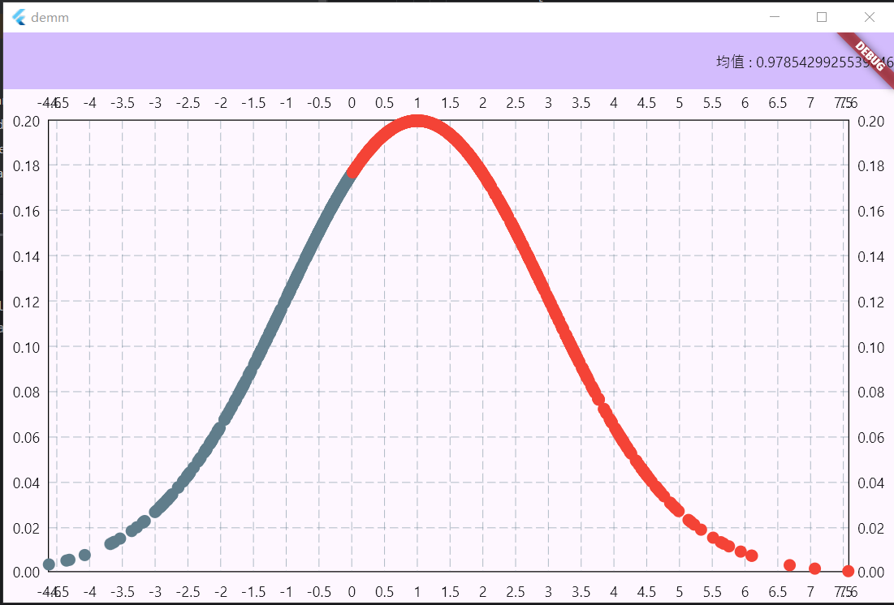

# 构造函数

## 默认构造函数
```text
MatrixType(
  List<List<double>> data, {
    bool identityMatrix = false,
    bool principalDiagonalMatrix = false,
    bool subDiagonalMatrix = false,
    bool upperTriangularMatrix = false,
    bool lowerTriangularMatrix = false,
    bool singularMatrix  = false
  })
```

> 默认构造函数必须传入一个二维数组，并接受指定一些矩阵的特殊性质，对于该特殊性质并未做出任何操作，考虑到一些矩阵的特殊性质——如对角方阵可以以O(n)的复杂度求解行列式值，该性质可以视为做出简易计算的接口。

### example
```dart
main() {
  final List<List<double>> list = [
    [1, 2, 3],
    [4, 5, 6],
    [7, 8, 9],
    [1, 5, 9]
  ];
  MatrixType(list).visible();
}

/* outputs
[
 [1.00000	 2.00000	 3.00000	]
 [4.00000	 5.00000	 6.00000	]
 [7.00000	 8.00000	 9.00000	]
 [1.00000	 5.00000	 9.00000	]
]
 */
```

## 生成一个全是number数据的矩阵
```text
MatrixType.filled({
    required double number,
    required int row,
    required int column
  })
```

> 全number矩阵会生成row和column大小，对row和column的检查**不会**在C语言中实现，而是交给了Dart来做。在MartixType的所有功能都是这种原理。

### example
```dart
main() {
  set_visible_round('%.0f');
  MatrixType.filled(number: 4, row: 3, column: 5).visible();
}

/* outputs
[
 [4 4 4 4 4]
 [4 4 4 4 4]
 [4 4 4 4 4]
]
 */
```

## 全零矩阵与全一矩阵
```text
MatrixType.zeros({
    required int row,
    required int column
  })
  
MatrixType.ones({
    required int row,
    required int column
  })
```

### example
```dart
main() {
  set_visible_round('%.0f');
  MatrixType.ones(row: 3, column: 3).visible();
  MatrixType.zeros(row: 2, column: 4).visible();
}

/* outputs
[
 [1 1 1]
 [1 1 1]
 [1 1 1]
]
[
 [0 0 0 0]
 [0 0 0 0]
]
 */
```

## 创建从start开始，间隔为1的连续数据的矩阵
```text
 MatrixType.arrange({
    required double? start,
    required int row,
    required int column
  })
```

### example
```dart
main() {

  MatrixType.arrange(start: 0, row: 2, column: 10).visible();
}

/* outputs
[
 [0.00000	 1.00000	 2.00000	 3.00000	 4.00000	 5.00000	 6.00000	 7.00000	 8.00000	 9.00000	]
 [10.00000	 11.00000	 12.00000	 13.00000	 14.00000	 15.00000	 16.00000	 17.00000	 18.00000	 19.00000	]
]
 */
```

## 创建从start开始，到end结束，途中分为row * column份数的矩阵
```text
 MatrixType.linspace({
    required double start,
    required double end,
    required int row,
    required int column,
    bool keep = true
  }) 
```

> keep参数决定了是否保留end

### example 
```dart
main() {
  MatrixType.linspace(start: 0, end: 10, row: 1, column: 10, keep: true).visible();
  MatrixType.linspace(start: 0, end: 10, row: 1, column: 10, keep: false).visible();
}

/* outputs
[
 [0.00000	 1.11111	 2.22222	 3.33333	 4.44444	 5.55556	 6.66667	 7.77778	 8.88889	 10.00000	]
]
[
 [0.00000	 1.00000	 2.00000	 3.00000	 4.00000	 5.00000	 6.00000	 7.00000	 8.00000	 9.00000	]
]
 */
```

## 创建n阶单位矩阵
```text
MatrixType.E({required int n})
```

### example
```dart
main() {
  set_visible_round('%.0f');
  MatrixType.E(n: 5).visible();
}

/* outputs
[
 [1 0 0 0 0]
 [0 1 0 0 0]
 [0 0 1 0 0]
 [0 0 0 1 0]
 [0 0 0 0 1]
]
 */
```

## 生成符合均匀分布的数据
```text
MatrixType.uniform({
    double start = .0,
    double end = 1.0,
    required int row,
    required int column,
    int? seed
  }) 
```

> seed表明你是否设置针对此随机分布的种子

### example
```dart
// 基于FL_chart实现对均匀分布的散点图可视化
import 'package:flutter/material.dart';
import 'package:fl_chart/fl_chart.dart';
import 'matply.dart';

void main() {
  runApp(const MyApp());
}

class MyApp extends StatelessWidget {
  const MyApp({super.key});
  @override
  Widget build(BuildContext context) {
    return MaterialApp(
      title: 'Flutter Demo',
      theme: ThemeData(
        colorScheme: ColorScheme.fromSeed(seedColor: Colors.deepPurple),
        useMaterial3: true,
      ),
      home: const MyHomePage(),
    );
  }
}

class MyHomePage extends StatefulWidget {
  const MyHomePage({super.key});
  @override
  State<MyHomePage> createState() => _MyHomePageState();
}

final List<double> xp = MatrixType.uniform(row: 1, column: 1000, seed: 1)[0] as List<double>;
final List<double> yp = MatrixType.uniform(row: 1, column: 1000, seed: 2)[0] as List<double>;

List<ScatterSpot> points = List.generate(xp.length, (i) {
  return ScatterSpot(xp[i], yp[i]);
});

class _MyHomePageState extends State<MyHomePage> {

  @override
  Widget build(BuildContext context) {
    return Scaffold(
        appBar: AppBar(
          backgroundColor: Theme.of(context).colorScheme.inversePrimary,
        ),
        body: Center(
          child: ScatterChart(
              ScatterChartData(
                  scatterSpots: points
              )
          ),
        )
    );
  }
}

```

### 效果如下


## 生成符合正态分布数据
```text
MatrixType.normal({
    double mu = 0.0,
    double sigma = 1.0,
    required int row,
    required int column,
    int? seed
  })
```

> 该正态分布数据的拟合基于Box-Muller方法，感谢@Djl的贡献，由于是自己按照原理实现，因此略有精度误差

### example
```dart

import 'dart:math';

import 'package:flutter/material.dart';
import 'package:fl_chart/fl_chart.dart';
import 'matply.dart';

void main() {
  runApp(const MyApp());
}

class MyApp extends StatelessWidget {
  const MyApp({super.key});
  @override
  Widget build(BuildContext context) {
    return MaterialApp(
      title: 'Flutter Demo',
      theme: ThemeData(
        colorScheme: ColorScheme.fromSeed(seedColor: Colors.deepPurple),
        useMaterial3: true,
      ),
      home: const MyHomePage(),
    );
  }
}

class MyHomePage extends StatefulWidget {
  const MyHomePage({super.key});
  @override
  State<MyHomePage> createState() => _MyHomePageState();
}

var mt = MatrixType.normal(row: 1, column: 1000, mu: 1.0, sigma: 2.0);
List<double> ps = mt[0] as List<double>;

var fx = (double x) => (1 / (sqrt(2 * Pi) * 2.0) ) * exp(-(x - 1.0) * (x - 1.0) / (2 * 2.0 * 2.0));

List<ScatterSpot> points = List.generate(ps.length, (i) => ScatterSpot(ps[i], fx(ps[i])));

class _MyHomePageState extends State<MyHomePage> {

  @override
  Widget build(BuildContext context) {
    return Scaffold(
      appBar: AppBar(
        backgroundColor: Theme.of(context).colorScheme.inversePrimary,
        actions: [
          Text('均值 : ${mt.mean()}'),
        ],
      ),
      body: Center(
        child: ScatterChart(
          ScatterChartData(
            scatterSpots: points
          )
        )
      )
    );
  }
}
```

### 从数据点拟合的概率密度函数效果如下
> 经计算，均值为0.97，与规定的1.0大差不差


## 生成符合泊松分布数据
```text
 MatrixType.poisson({
    required double lambda,
    required int row,
    required int column,
    int? seed
  })
```

### example
```dart

import 'dart:math';

import 'package:flutter/material.dart';
import 'package:fl_chart/fl_chart.dart';
import 'matply.dart';

void main() {
  runApp(const MyApp());
}

class MyApp extends StatelessWidget {
  const MyApp({super.key});
  @override
  Widget build(BuildContext context) {
    return MaterialApp(
      title: 'Flutter Demo',
      theme: ThemeData(
        colorScheme: ColorScheme.fromSeed(seedColor: Colors.deepPurple),
        useMaterial3: true,
      ),
      home: const MyHomePage(),
    );
  }
}

class MyHomePage extends StatefulWidget {
  const MyHomePage({super.key});
  @override
  State<MyHomePage> createState() => _MyHomePageState();
}

var mt = MatrixType.poisson(lambda: 5.5, row: 1, column: 1000);
List<int> ps = (mt[0] as List<double>).map((double value) => value.toInt()).toList();

class _MyHomePageState extends State<MyHomePage> {
  @override
  Widget build(BuildContext context) {
    return Scaffold(
      appBar: AppBar(
        backgroundColor: Theme.of(context).colorScheme.inversePrimary,
      ),
      body: Center(
        child: Padding(
          padding: const EdgeInsets.all(16.0),
          child: _buildHistogram(),
        ),
      ),
    );
  }

  Widget _buildHistogram() {
    const binCount = 10;
    final int minPs = (mt.min(dim: -1) as double).toInt();
    final int maxPs = (mt.max(dim: -1) as double).toInt();
    final binSize = (maxPs - minPs) / binCount;
    final bins = List.generate(binCount, (_) => 0);

    for (var value in ps) {
      final bin = ((value - minPs) / binSize).floor();
      if (bin >= 0 && bin < bins.length) {
        bins[bin]++;
      }
    }

    final barGroups = List.generate(bins.length, (i) {
      return BarChartGroupData(
        x: i,
        barRods: [
          BarChartRodData(
            width: 16, toY: bins[i].toDouble(),
          ),
        ],
      );
    });

    return BarChart(
      BarChartData(
        alignment: BarChartAlignment.spaceAround,
        titlesData: const FlTitlesData(
          show: true,
        ),
        borderData: FlBorderData(show: false),
        barGroups: barGroups,
      ),
    );
  }
}

```

### 效果如下


## 指向C语言生成矩阵对象指针
```text
MatrixType.__fromPointer(this.self, this.shape)
```

> Warning ：不建议在Dart使用指针类，因此我设置了此构造函数为私有方法

## 工厂构造——深拷贝矩阵
```text
factory MatrixType.deepCopy(MatrixType other)
```

### example
```dart
main() {

  var m1 = MatrixType.E(n: 5);
  var m2 = MatrixType.deepCopy(m1);
  print(identityHashCode(m1));
  print(identityHashCode(m2));
  print(identical(m1, m2));
}

/* outputs
21077322
717773056
false
 */
```

## 生成最小维度下对角线上全是1，其他全是0的仿单位矩阵
```text
MatrixType.E_like({required int row, required int column})
```

### example
```dart
import 'matply.dart';

main(){
  MatrixType mt = MatrixType.E_like(row: 3, column: 5);
  mt.visible();
}

/*output
[
 [1.00000	 0.00000	 0.00000	 0.00000	 0.00000	]
 [0.00000	 1.00000	 0.00000	 0.00000	 0.00000	]
 [0.00000	 0.00000	 1.00000	 0.00000	 0.00000	]
]
* */
```

## 指定步长后，从start开始生成数据
```text
MatrixType.range({
    required double start,
    double step = 1.0,
    required int row,
    required int column
  })
```

### example
```dart
import 'matply.dart';

main(){
  MatrixType mt = MatrixType.range(row: 3, column: 5, start: 2.5, step: 0.5);
  mt.visible();
}

/*output
[
 [2.50000	 3.00000	 3.50000	 4.00000	 4.50000	]
 [5.00000	 5.50000	 6.00000	 6.50000	 7.00000	]
 [7.50000	 8.00000	 8.50000	 9.00000	 9.50000	]
]
* */
```

