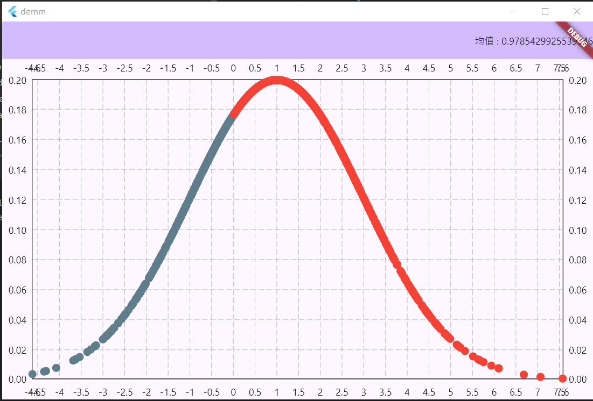
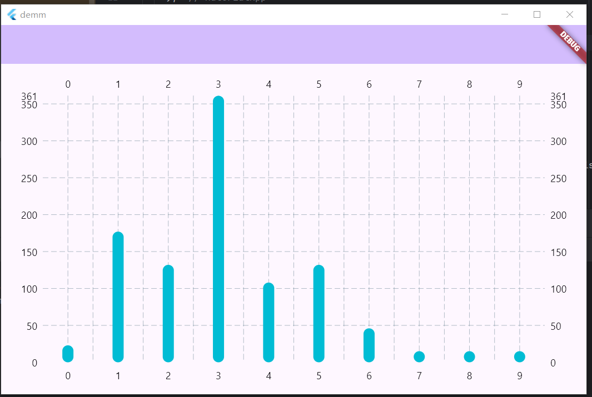

# 构造函数

## 默认构造函数
```text
MatrixType(
  List<List<double>> data, {
    int? row,
    int? column,
    bool identityMatrix = false,
    bool principalDiagonalMatrix = false,
    bool subDiagonalMatrix = false,
    bool upperTriangularMatrix = false,
    bool lowerTriangularMatrix = false,
    bool singularMatrix  = false
  })
```
> 1. 默认构造函数必须传入一个二维数组，并接受指定一些矩阵的特殊性质，对于该特殊性质并未做出任何操作，考虑到一些矩阵的特殊性质——如对角方阵可以以O(n)的复杂度求解行列式值，该性质可以视为做出简易计算的接口。
> 2. 注：自**V1.0.8**开始，基本构造函数添加了选择性传入形状（如果已知，但必须保证正整数，不做检查），则免去了计算机自动计算形状。


### example
```dart
main() {
  final List<List<double>> list = [
    [1, 2, 3],
    [4, 5, 6],
    [7, 8, 9],
    [1, 5, 9]
  ];
  MatrixType(list).visible();
}

/* outputs
[
 [1.00000	 2.00000	 3.00000	]
 [4.00000	 5.00000	 6.00000	]
 [7.00000	 8.00000	 9.00000	]
 [1.00000	 5.00000	 9.00000	]
]
 */
```

## 生成一个全是number数据的矩阵
```text
MatrixType.filled({
    required double number,
    required int row,
    required int column
  })
```

> 全number矩阵会生成row和column大小，对row和column的检查**不会**在C语言中实现，而是交给了Dart来做。在MartixType的所有功能都是这种原理。

### example
```dart
main() {
  set_visible_round('%.0f');
  MatrixType.filled(number: 4, row: 3, column: 5).visible();
}

/* outputs
[
 [4 4 4 4 4]
 [4 4 4 4 4]
 [4 4 4 4 4]
]
 */
```

## 全 0 / 1 矩阵
```text
MatrixType.zeros({
    required int row,
    required int column
  })
  
MatrixType.ones({
    required int row,
    required int column
  })
```

### example
```dart
main() {
  set_visible_round('%.0f');
  MatrixType.ones(row: 3, column: 3).visible();
  MatrixType.zeros(row: 2, column: 4).visible();
}

/* outputs
[
 [1 1 1]
 [1 1 1]
 [1 1 1]
]
[
 [0 0 0 0]
 [0 0 0 0]
]
 */
```

## 创建从start开始，间隔为1的连续数据的矩阵
```text
 MatrixType.arrange({
    required double? start,
    required int row,
    required int column
  })
```

### example
```dart
main() {

  MatrixType.arrange(start: 0, row: 2, column: 10).visible();
}

/* outputs
[
 [0.00000	 1.00000	 2.00000	 3.00000	 4.00000	 5.00000	 6.00000	 7.00000	 8.00000	 9.00000	]
 [10.00000	 11.00000	 12.00000	 13.00000	 14.00000	 15.00000	 16.00000	 17.00000	 18.00000	 19.00000	]
]
 */
```

## 创建从start开始，到end结束，途中分为row * column份数的矩阵
```text
 MatrixType.linspace({
    required double start,
    required double end,
    required int row,
    required int column,
    bool keep = true
  }) 
```

> keep参数决定了是否保留end

### example 
```dart
main() {
  MatrixType.linspace(start: 0, end: 10, row: 1, column: 10, keep: true).visible();
  MatrixType.linspace(start: 0, end: 10, row: 1, column: 10, keep: false).visible();
}

/* outputs
[
 [0.00000	 1.11111	 2.22222	 3.33333	 4.44444	 5.55556	 6.66667	 7.77778	 8.88889	 10.00000	]
]
[
 [0.00000	 1.00000	 2.00000	 3.00000	 4.00000	 5.00000	 6.00000	 7.00000	 8.00000	 9.00000	]
]
 */
```

## 创建n阶单位矩阵
```text
MatrixType.E({required int n})
```

### example
```dart
main() {
  set_visible_round('%.0f');
  MatrixType.E(n: 5).visible();
}

/* outputs
[
 [1 0 0 0 0]
 [0 1 0 0 0]
 [0 0 1 0 0]
 [0 0 0 1 0]
 [0 0 0 0 1]
]
 */
```

## 生成符合均匀分布的数据
```text
MatrixType.uniform({
    double start = .0,
    double end = 1.0,
    required int row,
    required int column,
    int? seed
  }) 
```

> seed表明你是否设置针对此随机分布的种子

### example
```dart
// 基于FL_chart实现对均匀分布的散点图可视化
import 'package:flutter/material.dart';
import 'package:fl_chart/fl_chart.dart';
import 'matply.dart';

void main() {
  runApp(const MyApp());
}

class MyApp extends StatelessWidget {
  const MyApp({super.key});
  @override
  Widget build(BuildContext context) {
    return MaterialApp(
      title: 'Flutter Demo',
      theme: ThemeData(
        colorScheme: ColorScheme.fromSeed(seedColor: Colors.deepPurple),
        useMaterial3: true,
      ),
      home: const MyHomePage(),
    );
  }
}

class MyHomePage extends StatefulWidget {
  const MyHomePage({super.key});
  @override
  State<MyHomePage> createState() => _MyHomePageState();
}

final List<double> xp = MatrixType.uniform(row: 1, column: 1000, seed: 1)[0] as List<double>;
final List<double> yp = MatrixType.uniform(row: 1, column: 1000, seed: 2)[0] as List<double>;

List<ScatterSpot> points = List.generate(xp.length, (i) {
  return ScatterSpot(xp[i], yp[i]);
});

class _MyHomePageState extends State<MyHomePage> {

  @override
  Widget build(BuildContext context) {
    return Scaffold(
        appBar: AppBar(
          backgroundColor: Theme.of(context).colorScheme.inversePrimary,
        ),
        body: Center(
          child: ScatterChart(
              ScatterChartData(
                  scatterSpots: points
              )
          ),
        )
    );
  }
}

```

### 效果如下


## 生成符合正态分布数据
```text
MatrixType.normal({
    double mu = 0.0,
    double sigma = 1.0,
    required int row,
    required int column,
    int? seed
  })
```

> 该正态分布数据的拟合基于Box-Muller方法，感谢@Djl的贡献，由于是自己按照原理实现，因此略有精度误差

### example
```dart

import 'dart:math';

import 'package:flutter/material.dart';
import 'package:fl_chart/fl_chart.dart';
import 'matply.dart';

void main() {
  runApp(const MyApp());
}

class MyApp extends StatelessWidget {
  const MyApp({super.key});
  @override
  Widget build(BuildContext context) {
    return MaterialApp(
      title: 'Flutter Demo',
      theme: ThemeData(
        colorScheme: ColorScheme.fromSeed(seedColor: Colors.deepPurple),
        useMaterial3: true,
      ),
      home: const MyHomePage(),
    );
  }
}

class MyHomePage extends StatefulWidget {
  const MyHomePage({super.key});
  @override
  State<MyHomePage> createState() => _MyHomePageState();
}

var mt = MatrixType.normal(row: 1, column: 1000, mu: 1.0, sigma: 2.0);
List<double> ps = mt[0] as List<double>;

var fx = (double x) => (1 / (sqrt(2 * Pi) * 2.0) ) * exp(-(x - 1.0) * (x - 1.0) / (2 * 2.0 * 2.0));

List<ScatterSpot> points = List.generate(ps.length, (i) => ScatterSpot(ps[i], fx(ps[i])));

class _MyHomePageState extends State<MyHomePage> {

  @override
  Widget build(BuildContext context) {
    return Scaffold(
      appBar: AppBar(
        backgroundColor: Theme.of(context).colorScheme.inversePrimary,
        actions: [
          Text('均值 : ${mt.mean()}'),
        ],
      ),
      body: Center(
        child: ScatterChart(
          ScatterChartData(
            scatterSpots: points
          )
        )
      )
    );
  }
}
```

### 从数据点拟合的概率密度函数效果如下
> 经计算，均值为0.97，与规定的1.0大差不差


## 生成符合泊松分布数据
```text
 MatrixType.poisson({
    required double lambda,
    required int row,
    required int column,
    int? seed
  })
```

### example
```dart

import 'dart:math';

import 'package:flutter/material.dart';
import 'package:fl_chart/fl_chart.dart';
import 'matply.dart';

void main() {
  runApp(const MyApp());
}

class MyApp extends StatelessWidget {
  const MyApp({super.key});
  @override
  Widget build(BuildContext context) {
    return MaterialApp(
      title: 'Flutter Demo',
      theme: ThemeData(
        colorScheme: ColorScheme.fromSeed(seedColor: Colors.deepPurple),
        useMaterial3: true,
      ),
      home: const MyHomePage(),
    );
  }
}

class MyHomePage extends StatefulWidget {
  const MyHomePage({super.key});
  @override
  State<MyHomePage> createState() => _MyHomePageState();
}

var mt = MatrixType.poisson(lambda: 5.5, row: 1, column: 1000);
List<int> ps = (mt[0] as List<double>).map((double value) => value.toInt()).toList();

class _MyHomePageState extends State<MyHomePage> {
  @override
  Widget build(BuildContext context) {
    return Scaffold(
      appBar: AppBar(
        backgroundColor: Theme.of(context).colorScheme.inversePrimary,
      ),
      body: Center(
        child: Padding(
          padding: const EdgeInsets.all(16.0),
          child: _buildHistogram(),
        ),
      ),
    );
  }

  Widget _buildHistogram() {
    const binCount = 10;
    final int minPs = (mt.min(dim: -1) as double).toInt();
    final int maxPs = (mt.max(dim: -1) as double).toInt();
    final binSize = (maxPs - minPs) / binCount;
    final bins = List.generate(binCount, (_) => 0);

    for (var value in ps) {
      final bin = ((value - minPs) / binSize).floor();
      if (bin >= 0 && bin < bins.length) {
        bins[bin]++;
      }
    }

    final barGroups = List.generate(bins.length, (i) {
      return BarChartGroupData(
        x: i,
        barRods: [
          BarChartRodData(
            width: 16, toY: bins[i].toDouble(),
          ),
        ],
      );
    });

    return BarChart(
      BarChartData(
        alignment: BarChartAlignment.spaceAround,
        titlesData: const FlTitlesData(
          show: true,
        ),
        borderData: FlBorderData(show: false),
        barGroups: barGroups,
      ),
    );
  }
}

```

### 效果如下


## 指向C语言生成矩阵对象指针
```text
MatrixType.fromPointer(this.self, this.shape)
```

> 注:
> V1.0.8开始，fromPointer从__fromPointer设置为公有方法

## 工厂构造——深拷贝矩阵
```text
factory MatrixType.deepCopy(MatrixType other)
```

### example
```dart
main() {

  var m1 = MatrixType.E(n: 5);
  var m2 = MatrixType.deepCopy(m1);
  print(identityHashCode(m1));
  print(identityHashCode(m2));
  print(identical(m1, m2));
}

/* outputs
21077322
717773056
false
 */
```

## 生成最小维度下对角线上全是1，其他全是0的仿单位矩阵
```text
MatrixType.E_like({required int row, required int column})
```

### example
```dart
import 'matply.dart';

main(){
  MatrixType mt = MatrixType.E_like(row: 3, column: 5);
  mt.visible();
}

/*output
[
 [1.00000	 0.00000	 0.00000	 0.00000	 0.00000	]
 [0.00000	 1.00000	 0.00000	 0.00000	 0.00000	]
 [0.00000	 0.00000	 1.00000	 0.00000	 0.00000	]
]
* */
```

## 指定步长后，从start开始生成数据
```text
MatrixType.range({
    required double start,
    double step = 1.0,
    required int row,
    required int column
  })
```

### example
```dart
import 'matply.dart';

main(){
  MatrixType mt = MatrixType.range(row: 3, column: 5, start: 2.5, step: 0.5);
  mt.visible();
}

/*output
[
 [2.50000	 3.00000	 3.50000	 4.00000	 4.50000	]
 [5.00000	 5.50000	 6.00000	 6.50000	 7.00000	]
 [7.50000	 8.00000	 8.50000	 9.00000	 9.50000	]
]
* */
```

## 获取对称对角阵，设置sub为true得到副对角线对称阵
```text
 MatrixType.Diag({
    required int n,
    required double start,
    required double end,
    bool sub = false,
    int? seed
  })
```

### example
```dart
import 'core.dart';

main(){
  MatrixType.Diag(n: 5, start: 1, end: 5, seed: 1)..visible();
  MatrixType.Diag(n: 5, start: 1, end: 5, seed: 2, sub: true)..visible();
}

/*
output
[
 [1.00501	 3.25434	 1.77322	 4.23496	 3.34004	]
 [3.25434	 2.91949	 2.40117	 4.58385	 4.29136	]
 [1.77322	 2.40117	 3.98642	 1.69643	 4.43577	]
 [4.23496	 4.58385	 1.69643	 3.84201	 3.05414	]
 [3.34004	 4.29136	 4.43577	 3.05414	 2.21598	]
]
[
 [2.81829	 4.53539	 4.92505	 3.23591	 4.59923	]
 [1.87490	 1.81277	 1.07398	 2.30680	 3.23591	]
 [3.30927	 4.70702	 2.54448	 1.07398	 4.92505	]
 [4.67260	 4.63939	 4.70702	 1.81277	 4.53539	]
 [2.34758	 4.67260	 3.30927	 1.87490	 2.81829	]
]

* */
```

## 指数分布
```text
MatrixType.exponential({
    required int row,
    required int column,
    required double scale,
    int? seed
  })
```

### example
```dart
import 'core.dart';

main(){
  initMp();
  set_visible_round('%.1f');
  MatrixType.exponential(row: 3, column: 6, scale: 0.5).visible();
  freeMp(visible: true, hex: false);
}

/*output
[
 [2.8 3.7 0.3 6.2 2.6 0.5]
 [1.5 0.6 2.7 6.0 1.8 0.7]
 [1.5 1.9 3.8 1.3 4.0 3.8]
]
Free Memory in location : 3044701056
 */
```

## 伽马分布
```text
 MatrixType.gamma({
    required int row,
    required int column,
    required double shape,
    required double scale,
    int? seed
  })
```

### example
```dart
import 'core.dart';

main(){
  initMp();
  set_visible_round('%.5f');
  MatrixType.gamma(row: 3, column: 6, scale: 0.5, shape: 1.0).visible();
  freeMp(visible: true, hex: true);
}

/*output
[
 [1.58136 0.08194 2.77598 0.34273 1.37208 0.56165]
 [2.88074 0.04974 0.32192 0.02766 1.67183 1.73036]
 [1.31752 0.84275 1.17293 2.81444 0.38546 0.50470]
]
Free Memory in location : 000001efb2bb7380
 */
```

## 二项分布（伯努利分布）
```text
MatrixType.binomial({
    required int row,
    required int column,
    required int n,
    required double p,
    int? seed
  })
```

### example
```dart
import 'core.dart';

main(){
  initMp();
  set_visible_round('%.5f');
  MatrixType.binomial(row: 2, column: 6, p: 0.5, n: 10).visible();
  freeMp(visible: true, hex: true);
}

/*output
[
 [4.00000 3.00000 3.00000 4.00000 3.00000 5.00000]
 [3.00000 5.00000 6.00000 7.00000 2.00000 9.00000]
]
Free Memory in location : 000002069dfb7300
 */
```

## 卡方分布
```text
MatrixType.chisquare({
    required int row,
    required int column,
    required int k,
    int? seed
  })
```

### example
```dart
import 'core.dart';

main(){
  initMp();
  set_visible_round('%.5f');
  MatrixType.chisquare(row: 2, column: 10, k: 10).visible();
  freeMp(visible: true, hex: true);
}

/*output
[
 [15.56649 6.49801 15.22481 19.63363 13.40057 7.41420 6.87870 8.56945 10.14679 12.19465]
 [10.69842 12.52793 13.45222 16.02619 2.52850 14.73268 1.99553 14.03686 23.45220 13.17031]
]
Free Memory in location : 00000224f20d7380
 */import 'core.dart';

main(){
  initMp();
  set_visible_round('%.5f');
  MatrixType.chisquare(row: 2, column: 10, k: 10).visible();
  freeMp(visible: true, hex: true);
}

/*output
[
 [15.56649 6.49801 15.22481 19.63363 13.40057 7.41420 6.87870 8.56945 10.14679 12.19465]
 [10.69842 12.52793 13.45222 16.02619 2.52850 14.73268 1.99553 14.03686 23.45220 13.17031]
]
Free Memory in location : 00000224f20d7380
 */
```

## t分布
```text
MatrixType.tdis({
    required int row,
    required int column,
    required int k,
    int? seed
  })
```

### example
```dart
import 'core.dart';

main(){
  initMp();
  set_visible_round('%.5f');
  MatrixType.tdis(row: 2, column: 10, k: 10).visible();
  freeMp(visible: true, hex: true);
}

/*output
[
 [-1.55972 0.00143 0.06831 -0.95161 0.57509 0.04076 -0.85714 -1.25147 -0.10346 -1.21439]
 [-0.54939 0.15324 -1.64424 1.77921 0.30666 -2.25429 0.64608 -0.13936 -0.80505 0.06822]
]
Free Memory in location : 000002ad7b887380
 */
```
## F分布
```text
MatrixType.fdis({
    required int row,
    required int column,
    required int k1,
    required int k2,
    int? seed
  })
```

### example
```dart
import 'core.dart';

main(){
  initMp();
  set_visible_round('%.5f');
  MatrixType.fdis(row: 2, column: 10, k1: 10, k2: 10).visible();
  freeMp(visible: true, hex: true);
}

/*output
[
 [0.61269 0.50923 1.19459 1.13693 1.06316 3.46132 2.35123 0.70744 3.02284 3.84514]
 [0.57377 0.21793 1.49196 0.55962 1.06172 1.16347 1.17703 0.85898 1.48983 0.73666]
]
Free Memory in location : 000002c26e167380
 */
```

## 几何分布
```text
MatrixType.geometric({
    required int row,
    required int column,
    required double p,
    int? seed
  })
```

### example
```dart
import 'core.dart';

main(){
  initMp();
  set_visible_round('%.5f');
  MatrixType.geometric(row: 2, column: 10, p: .25).visible();
  freeMp(visible: true, hex: true);
}

/*output
[
 [12.00000 0.00000 0.00000 3.00000 0.00000 3.00000 1.00000 0.00000 2.00000 6.00000]
 [1.00000 3.00000 4.00000 7.00000 0.00000 1.00000 0.00000 8.00000 0.00000 2.00000]
]
Free Memory in location : 000001e2e1977380
 */
```

## 负二项分布
```text
MatrixType.nbinomial({
    required int row,
    required int column,
    required int n,
    required double p,
    int? seed
  }) 
```

### example
```dart
import 'core.dart';

main(){
  initMp();
  set_visible_round('%.5f');
  MatrixType.nbinomial(row: 2, column: 10, p: .5, n: 10).visible();
  freeMp(visible: true, hex: true);
}

/*output
[
 [8.00000 4.00000 10.00000 11.00000 10.00000 4.00000 14.00000 10.00000 16.00000 17.00000]
 [10.00000 11.00000 10.00000 8.00000 21.00000 11.00000 16.00000 9.00000 14.00000 9.00000]
]
Free Memory in location : 0000023d8ca17380
 */
```

## 对数正态分布
```text
MatrixType.lognormal({
    required int row,
    required int column,
    required double mu,
    required double sigma,
    int? seed
  })
```

### example
```dart
import 'core.dart';

main(){
  initMp();
  set_visible_round('%.5f');
  MatrixType.lognormal(row: 2, column: 10, mu: 0.5, sigma: 0).visible();
  MatrixType.lognormal(row: 2, column: 10, mu: 0.5, sigma: 0.5).visible();
  freeMp(visible: true, hex: true);
}

/*output
[
 [1.64872 1.64872 1.64872 1.64872 1.64872 1.64872 1.64872 1.64872 1.64872 1.64872]
 [1.64872 1.64872 1.64872 1.64872 1.64872 1.64872 1.64872 1.64872 1.64872 1.64872]
]
[
 [3.81646 2.29163 1.33575 2.29506 1.17002 1.19118 1.22871 2.71503 2.29982 2.71270]
 [1.25637 1.75886 2.28643 1.04136 0.98519 0.86194 2.23628 1.92314 1.92319 1.46729]
]
Free Memory in location : 0000014647557380
Free Memory in location : 00000146475573a0
 */
```

## 柯西分布
```text
MatrixType.cauchydis({
    required int row,
    required int column,
    required double base,
    required double gamma,
    int? seed
  })
```

### example
```dart
import 'core.dart';

main(){
  initMp();
  set_visible_round('%.5f');
  MatrixType.cauchydis(row: 2, column: 10, base: 1, gamma: 0.5).visible();
  freeMp(visible: true, hex: true);
}

/*output
[
 [0.37542 0.98209 2.42007 0.57578 -3.74944 0.93080 0.72307 -4.37754 -1.45691 1.58629]
 [0.63870 3.46659 0.68280 -8.66677 1.43988 1.24878 1.85410 1.25154 -2.21948 2.62520]
]
Free Memory in location : 000001e62cd87380
 */
```

## 多项式分布
```text
MatrixType.multinomial({
    required List<double> p,
    required int n,
    required int size,
    int? seed
  })
```

### example
```dart
import 'core.dart';

main(){
  initMp();
  set_visible_round('%.0f');
  MatrixType.multinomial(p: [0.3, 0.2, 0.3, 0.05, 0.15], n: 10, size: 3).visible();
  freeMp(visible: true, hex: true);
}

/*output
[
 [2 3 4 1 0]
 [5 1 2 0 2]
 [2 0 8 0 0]
]
Free Memory in location : 00000276fd067320
 */
```

## 贝塔分布
```text
MatrixType.beta({
    required int row,
    required int column,
    required double a,
    required double b,
    int? seed
  }):
```

### example
```dart
import 'core.dart';

main(){
  initMp();
  set_visible_round('%.2f');
  MatrixType.beta(row: 2, column: 6, a: .5, b: .5).visible();
  freeMp(visible: true, hex: true);
}

/*output
[
 [0.27 0.91 0.69 0.55 0.41 0.96]
 [0.89 0.23 0.90 0.17 0.60 0.75]
]
Free Memory in location : 000001dd73d47300
 */
```

## 维纳过程
```text
MatrixType.wiener_process({
    required int row,
    required int column,
    required double t,
    int? seed
  })
```

### example
```dart
import 'core.dart';

main(){
  initMp();
  set_visible_round('%.6f');
  MatrixType.wiener_process(row: 1, column:10, t: 6.0).visible();
  MatrixType.wiener_process(row: 1, column:10, t: .6).visible();
  freeMp(visible: true, hex: true);
}

/*output
[
 [0.000000 -0.494991 -1.613652 -1.003171 -0.746069 1.047979 1.297541 1.423661 1.165988 1.294647]
]
[
 [0.000000 -0.156530 -0.510282 -0.317230 -0.235928 0.331400 0.410318 0.450201 0.368718 0.409403]
]
Free Memory in location : 0000028f4ab81d80
Free Memory in location : 0000028f4ab81da0
 */
```

## 维纳过程某时间戳
```text
MatrixType.wiener_process_stage({
    required int row,
    required int column,
    required double t1,
    required double t2,
    required double base,
    int? seed
  })
```

### example
```dart
import 'core.dart';

main(){
  initMp();
  set_visible_round('%.6f');
  MatrixType.wiener_process_stage(row: 2, column:8, t1: 6.0, t2: 11.0, base: 1.14).visible();
  freeMp(visible: true, hex: true);
}

/*output
[
 [1.140000 0.632525 0.594452 -0.243608 0.212239 0.289958 0.430776 -0.225537]
 [1.140000 0.859476 0.931509 1.334139 2.012373 2.806146 3.353208 3.149699]
]
Free Memory in location : 000001e34b087350
 */
```

## 狄利克雷分布
```text
MatrixType.dirichlet({
    required List<num> alpha,
    required int size,
    int? seed
  })
```

### example
```dart
import 'core.dart';

main(){
  initMp();
  set_visible_round('%.6f');
  MatrixType.dirichlet(alpha: [0.2, 0.6, 0.4, 0.2, 0.15], size: 3).visible();
  freeMp(visible: true, hex: true);
}

/*output
[
 [0.005214 0.336047 0.320509 0.060260 0.277970]
 [0.013985 0.527971 0.016174 0.004724 0.437147]
 [0.000005 0.930178 0.027854 0.028430 0.013533]
]
Free Memory in location : 0000019b3a2f7040
 */
```

## 拉普拉斯分布
```text
MatrixType.laplacedis({
    required int row,
    required int column,
    required double mu,
    required double b,
    int? seed
  })
```

### example
```dart
import 'core.dart';

main(){
  initMp();
  set_visible_round('%.6f');
  MatrixType.laplacedis(row: 2, column: 6, mu: 0.5, b: 1.0).visible();
  freeMp(visible: true, hex: true);
}

/*output
[
 [0.774634 0.382278 1.694869 0.325200 0.745268 -1.411681]
 [1.796428 0.719701 0.746751 1.678075 -1.453415 1.818313]
]
Free Memory in location : 0000023bc58b7300
 */
```

## 耿贝尔分布
```text
MatrixType.gumbel({
    required int row,
    required int column,
    required double mu,
    required double beta,
    bool left = true,
    int? seed
  })
```

### example
```dart
import 'core.dart';

main(){
  initMp();
  set_visible_round('%.6f');
  MatrixType.gumbel(row: 1, column: 10, mu: 0.5, beta: 1).visible();
  freeMp(visible: true, hex: true);
}

/*output
[
 [-0.271253 0.792400 -0.657043 -0.349956 1.168808 -0.522410 1.442951 -2.173026 0.170748 -0.329818]
]
Free Memory in location : 0000021ce0bd1d80
 */
```

## 超几何分布
```text
MatrixType.hypergeometric({
    required int row,
    required int column,
    required int expected,
    required int unexpected,
    required int n,
    int? seed
  }) 
```

### example
```dart
import 'core.dart';

main(){
  initMp();
  set_visible_round('%.0f');
  MatrixType.hypergeometric(row: 2, column: 6, expected: 5, unexpected: 12, n: 10).visible();
  freeMp(visible: true, hex: true);
}

/*output
[
 [3 2 4 2 3 2]
 [2 4 2 1 2 5]
]
Free Memory in location : 000001d91f5c7300
 */
```

## 对数级数分布
```text
MatrixType.logseries({
    required int row,
    required int column,
    required double p,
    int? seed
  })
```

### example
```dart
import 'core.dart';

main(){
  initMp();
  set_visible_round('%.2f');
  MatrixType.logseries(row: 2, column: 6, p: 0.5).visible();
  freeMp(visible: true, hex: true);
}

/*output
[
 [0.33 0.25 0.28 0.80 0.28 0.54]
 [0.49 0.40 0.57 0.44 0.38 0.28]
]
Free Memory in location : 00000188144a7300
 */
```

## 韦伯分布
```text
MatrixType.weibull({
    required int row,
    required int column,
    required double lambda,
    required double k,
    int? seed
}) 
```

### example
```dart
import 'core.dart';

main(){
  initMp();
  set_visible_round('%.2f');
  MatrixType.weibull(row: 2, column: 4, lambda: 1.0, k: 1.5).visible();
  freeMp(visible: true, hex: true);
}

/*output
[
 [0.25 1.78 0.19 1.44]
 [1.02 0.12 1.26 1.67]
]
Free Memory in location : 000001bf5b3a1d80
 */
```

## 三角分布
```text
MatrixType.triangular({
    required int row,
    required int column,
    required double left,
    required double middle,
    required double right,
    int? seed
  })
```

### example
```dart
import 'core.dart';

main(){
  initMp();
  set_visible_round('%.5f');
  MatrixType.triangular(row: 2, column: 7, left: 1.0, middle: 2.0, right: 3.0).visible();
  freeMp(visible: true, hex: true);
}

/*output
[
 [2.56347 1.71591 2.46651 2.27200 2.11517 1.80078 1.52699]
 [1.96187 2.26499 2.86997 1.59944 2.23217 1.81338 2.62818]
]
Free Memory in location : 000001ca14a87300
 */
```

## 幂定律分布
```text
MatrixType.power_law({
    required int row,
    required int column,
    required double xmin,
    required double alpha,
    int? seed
  })
```

### example
```dart
import 'core.dart';

main(){
  initMp();
  set_visible_round('%.5f');
  MatrixType.power_law(row: 2, column: 7, xmin: 2, alpha: 11.1).visible();
  freeMp(visible: true, hex: true);
}

/*output
[
 [2.24022 2.20870 2.94802 2.87119 2.13304 2.05349 2.13515]
 [2.26827 2.71454 2.05313 2.14800 2.20670 2.94668 2.19404]
]
Free Memory in location : 000002bf4a287300
 */
```

## 瑞利分布
```text
MatrixType.rayleigh({
    required int row,
    required int column,
    required double sigma,
    int? seed
  })
```

### example
```dart
import 'core.dart';

main(){
  initMp();
  set_visible_round('%.5f');
  MatrixType.rayleigh(row: 2, column: 6, sigma: 1).visible();
  freeMp(visible: true, hex: true);
}

/*output
[
 [1.53414 1.73643 1.02215 2.37727 0.88869 2.75930]
 [1.77184 2.58797 0.90467 1.93270 0.38486 1.69292]
]
Free Memory in location : 000002246e4b7300
 */
```

## 稳定分布
```text
MatrixType.stabledis({
    required int row,
    required int column,
    required double alpha,
    required double beta,
    required double gamma,
    required double delta,
    int? seed
  }) 
```

### example
```dart
import 'core.dart';

main(){
  initMp();
  set_visible_round('%.5f');
  MatrixType.stabledis(row: 2, column: 8, alpha: pi / 2, beta: 0.05, gamma: 1.5, delta: 2).visible();
  freeMp(visible: true, hex: true);
}

/*output
[
 [2.81285 0.94737 -0.84381 2.21197 -0.03858 5.08785 4.30831 3.10489]
 [-0.49566 4.02022 11.08963 1.96012 -0.43667 1.42398 0.89637 3.43363]
]
Free Memory in location : 0000029729597350
 */
```

## 帕累托分布
```text
MatrixType.pareto({
    required int row,
    required int column,
    required double xmin,
    required double alpha,
    int? seed
  })
```

### example
```dart
import 'core.dart';

main(){
  initMp();
  set_visible_round('%.5f');
  MatrixType.pareto(row: 2, column: 6, xmin: 2, alpha: 0.5).visible();
  freeMp(visible: true, hex: true);
}

/*output
[
 [30.98381 3.27788 5035.89882 6.14139 10.53488 2.88652]
 [6.94651 4.99984 6.71013 40.57302 13.55804 7.76927]
]
Free Memory in location : 00000142854c7300
 */
```

## 
```text
MatrixType.rice({
    required int row,
    required int column,
    required double v,
    required double sigma,
    int? seed
  })
```

### 莱斯分布example
```dart
import 'core.dart';

main(){
  initMp();
  set_visible_round('%.5f');
  MatrixType.rice(row: 2, column: 9, v: .5, sigma: .5).visible();
  freeMp(visible: true, hex: true);
}

/*output
[
 [0.60613 1.51139 1.32982 0.76693 0.49445 1.00509 1.39435 1.57219 1.10378]
 [1.11027 0.52717 0.35058 0.16057 0.28000 0.75422 1.58283 0.97214 0.86201]
]
Free Memory in location : 0000022585957350
 */
```

## 逆高斯分布
```text
MatrixType.wald({
    required int row,
    required int column,
    required double mu,
    required double sigma,
    int? seed
  })
```

### example
```dart
import 'core.dart';

main(){
  initMp();
  set_visible_round('%.5f');
  MatrixType.wald(row: 2, column: 9, mu: .5, sigma: .5).visible();
  freeMp(visible: true, hex: true);
}

/*output
[
 [0.25622 0.28209 0.25044 0.43373 0.29696 0.69026 0.59955 0.26258 0.29329]
 [1.25087 1.57323 0.30614 0.44101 0.25149 0.30327 0.29911 0.98868 2.15261]
]
Free Memory in location : 000002f0d1f97350
 */
```

[下一篇：重载操作符](operators.md)