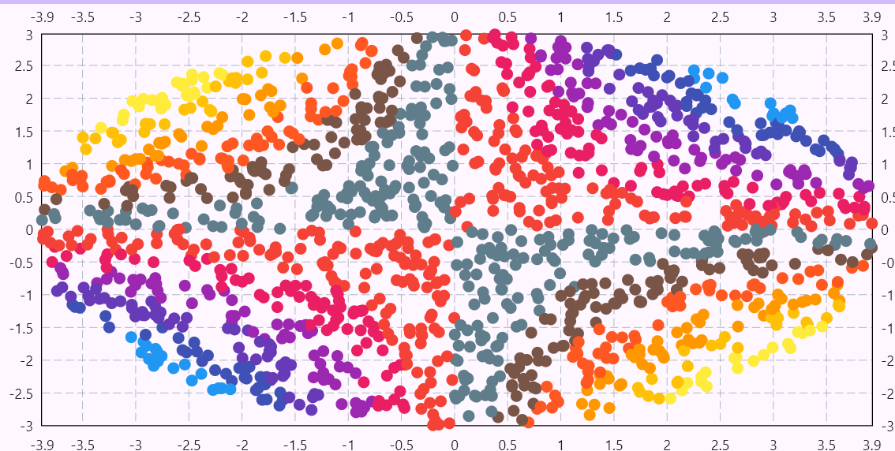
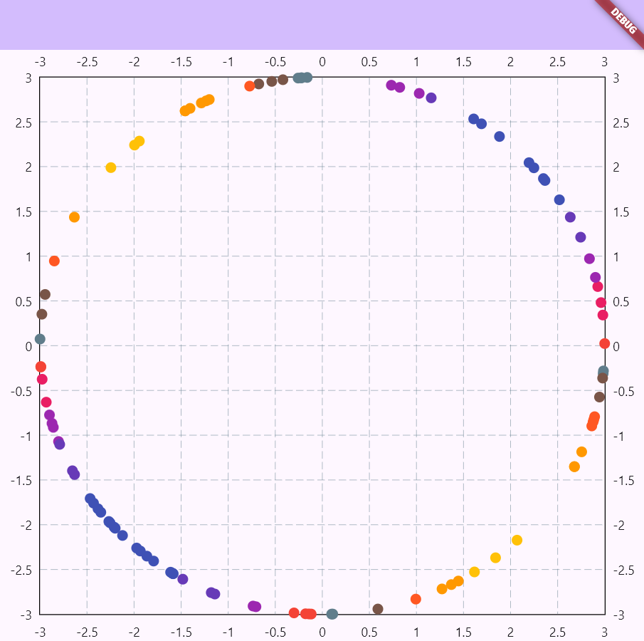
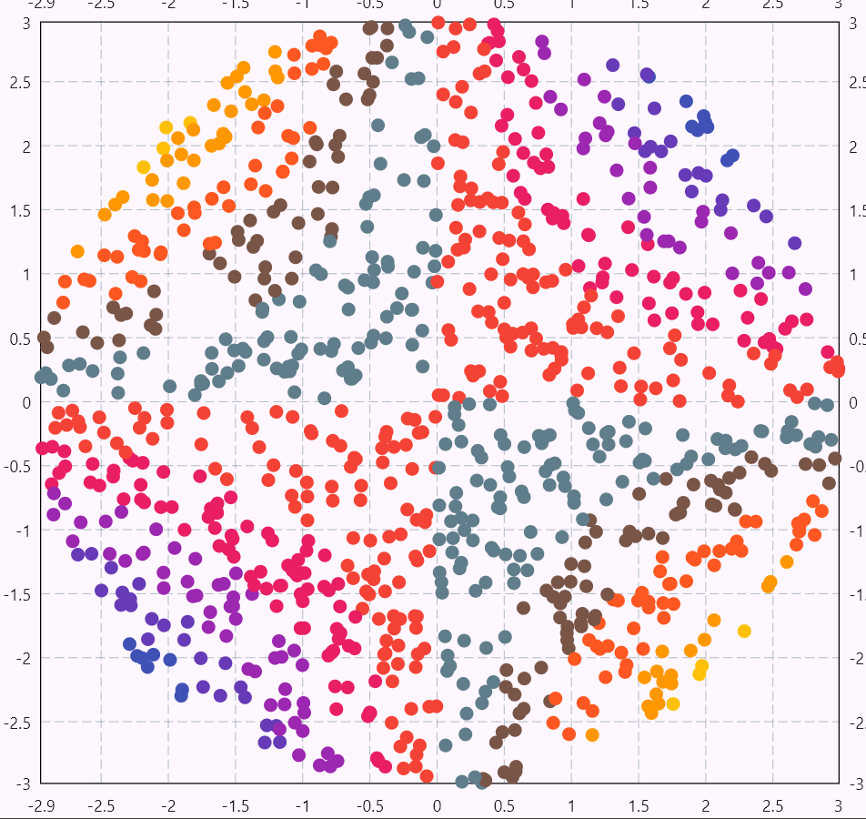
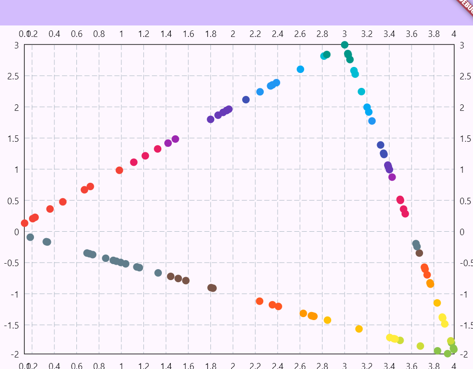
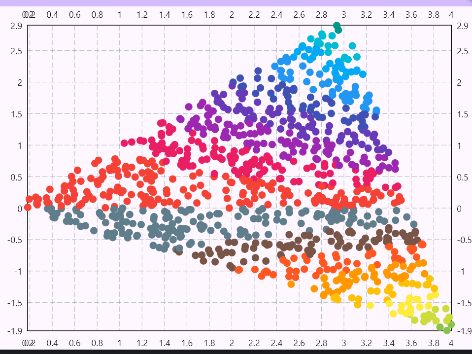
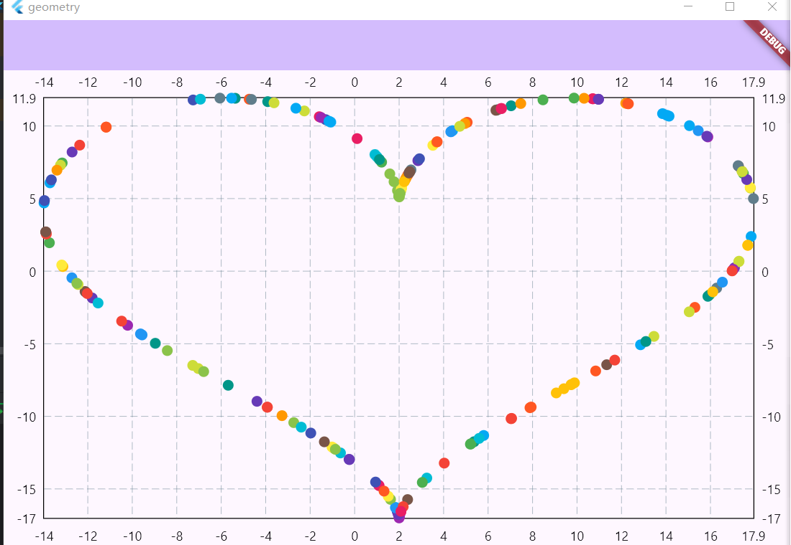
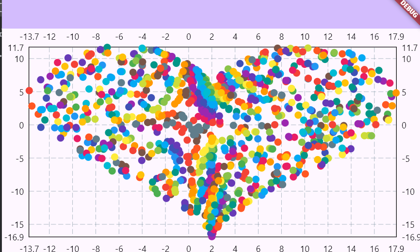
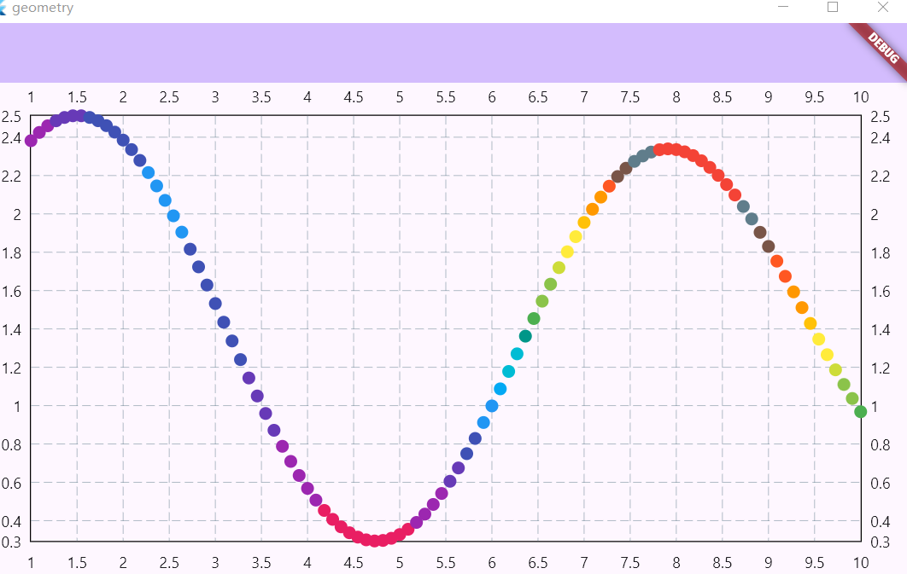
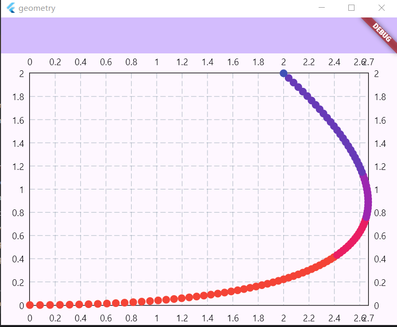

# 几何数据模拟（GeometryGenerator）
> 机理：
> GeometryGenerator的每个类都拥有一个bias参数，默认是0，
> 表明获取的是目标的源数据，当bias不为0的时候，数据会进行[-bias/2, bias/2]范围内的偏移（或者说噪音影响）

## 椭圆边缘
```text
static MatrixType ellipse_edge({
    int size = 50,
    required double a,
    required double b,
    int? seed,
    double bias
  })
```

### example
```text
...
final List<List<double>> ellipseEdgeDatas = GeometryGenerator.ellipse_edge(
  a: 4.0, b: 3.0, size: 100
).toList<double>() as List<List<double>>;
...
ScatterChartData(
    scatterSpots: List<ScatterSpot>.generate(100, (e) {
      var [x, y] = ellipseEdgeDatas[e];
      return ScatterSpot(x, y,);
    })
)
...
```

> 效果
> 

## 椭圆区域
```text
static MatrixType ellipse_area({
    int size = 50,
    required double a,
    required double b,
    int? seed,
    double bias
  })
```

### example
```text
...
final List<List<double>> ellipseAreaDatas = GeometryGenerator.ellipse_area(
  a: 4.0, b: 3.0, size: 1500
).toList<double>() as List<List<double>>;
...
ScatterChartData(
    scatterSpots: List<ScatterSpot>.generate(1500, (e) {
      var [x, y] = ellipseAreaDatas[e];
      return ScatterSpot(x, y,);
    })
),
...
```

> 效果
> 

## 圆边缘
```text
static MatrixType circle_edge({
    int size = 50,
    required double r,
    int? seed,
    double bias
  })
```

### example
```text
...
final List<List<double>> circleEdgeDatas = GeometryGenerator.circle_edge(
  r: 3.0, size: 100
).toList<double>() as List<List<double>>;
...
body: ScatterChart(
ScatterChartData(
    scatterSpots: List<ScatterSpot>.generate(100, (e) {
      var [x, y] = circleEdgeDatas[e];
      return ScatterSpot(x, y,);
    })
),
...
```

> 效果
> 

## 圆区域
```text
static MatrixType circle_area({
    int size = 50,
    required double r,
    int? seed,
    double bias
  })
```

### example
```text
...
final List<List<double>> datas = GeometryGenerator.circle_area(
  r: 3.0, size: 1000
).toList<double>() as List<List<double>>;
...
body: ScatterChart(
ScatterChartData(
    scatterSpots: List<ScatterSpot>.generate(1000, (e) {
      var [x, y] = datas[e];
      return ScatterSpot(x, y,);
    })
),
...
```

> 效果
> 

## 线性模拟
```text
static MatrixType line({
    int size = 50,
    required math.Point<double> start,
    required math.Point<double> end,
    int? seed,
    double bias
}) 
```

### example
```text
...
final List<List<double>> datas = GeometryGenerator.line(
  start: const math.Point(0.0, 0.0), end: const math.Point(5.0, 4.0), size: 100
).toList<double>() as List<List<double>>;
...
body: ScatterChart(
ScatterChartData(
    scatterSpots: List<ScatterSpot>.generate(100, (e) {
      var [x, y] = datas[e];
      return ScatterSpot(x, y,);
    })
),
),
...
```

> 效果
>     

> 注：如果提供一元函数的系数来进行模拟，可以使用linewb来构造

## 三角形轮廓
```text
static MatrixType triangle_edge(
      {int size = 50,
      required math.Point<double> a,
      required math.Point<double> b,
      required math.Point<double> c,
      int? seed,
      double bias})
```

### example
```text
...
final List<List<double>> datas = GeometryGenerator.triangle_edge(
  a: const math.Point(0.0, 0.0),
  b: const math.Point(3.0, 3.0),
  c: const math.Point(4, -2),
  size: 100
).toList<double>() as List<List<double>>;
...
body: ScatterChart(
ScatterChartData(
    scatterSpots: List<ScatterSpot>.generate(100, (e) {
      var [x, y] = datas[e];
      return ScatterSpot(x, y,);
    })
),
...
```

> 效果
> 

## 三角形区域
```text
static MatrixType triangle_area(
      {int size = 50,
      required math.Point<double> a,
      required math.Point<double> b,
      required math.Point<double> c,
      int? seed,
      double bias})
```

### example
```text
...
final List<List<double>> datas = GeometryGenerator.triangle_area(
  a: const math.Point(0.0, 0.0),
  b: const math.Point(3.0, 3.0),
  c: const math.Point(4, -2),
  size: 1000
).toList<double>() as List<List<double>>;
...
body: ScatterChart(
ScatterChartData(
    scatterSpots: List<ScatterSpot>.generate(1000, (e) {
      var [x, y] = datas[e];
      return ScatterSpot(x, y,);
    })
),
...
```

> 效果
> 

## 四边形轮廓
```text
static MatrixType quadrilateral_edge(
      {int size = 50,
      required math.Point<double> a,
      required math.Point<double> b,
      required math.Point<double> c,
      required math.Point<double> d,
      int? seed,
      double bias}) 
```
> 注意：从a到d是按照顺序连接的

### example
```text
...
final List<List<double>> datas = GeometryGenerator.quadrilateral_edge(
  a: const math.Point(0.0, 0.0),
  b: const math.Point(5.0, 0.0),
  c: const math.Point(5, 3),
  d: const math.Point(0, 3),
  size: 500
).toList<double>() as List<List<double>>;
...
body: ScatterChart(
ScatterChartData(
    scatterSpots: List<ScatterSpot>.generate(500, (e) {
      var [x, y] = datas[e];
      return ScatterSpot(x, y,);
    })
),
...
```

> 效果
> 

## 四边形区域
```text
static MatrixType quadrilateral_area(
      {int size = 50,
      required math.Point<double> a,
      required math.Point<double> b,
      required math.Point<double> c,
      required math.Point<double> d,
      int? seed,
      double bias})
```

### example
```text
...
final List<List<double>> datas = GeometryGenerator.quadrilateral_area(
  a: const math.Point(0.0, 0.0),
  b: const math.Point(1.5, 3),
  c: const math.Point(4, 1),
  d: const math.Point(2.5, -2),
  size: 1500
).toList<double>() as List<List<double>>;
...
body: ScatterChart(
ScatterChartData(
    scatterSpots: List<ScatterSpot>.generate(1500, (e) {
      var [x, y] = datas[e];
      return ScatterSpot(x, y,);
    })
),
...
```

> 效果
> 

## 心形线轮廓
```text
static MatrixType heart_edge({
    int size = 50,
    double x_center = 0.0, 
    int? seed,
    double bias
})
```

### example
```text
...
final List<List<double>> datas = GeometryGenerator.heart_edge(
  x_center: 2.0,
  size: 200
).toList<double>() as List<List<double>>;
...
body: ScatterChart(
ScatterChartData(
    scatterSpots: List<ScatterSpot>.generate(200, (e) {
      var [x, y] = datas[e];
      return ScatterSpot(x, y,);
    })
),
...
```

> 效果
> 

## 心形区域
```text
static MatrixType heart_area({
    int size = 50,
    double x_center = 0.0,
    int? seed,
    double bias
  })
```

### example
```text
...
final List<List<double>> datas = GeometryGenerator.heart_area(
  x_center: 2.0,
  size: 1200
).toList<double>() as List<List<double>>;
...
body: ScatterChart(
ScatterChartData(
    scatterSpots: List<ScatterSpot>.generate(1200, (e) {
      var [x, y] = datas[e];
      return ScatterSpot(x, y,);
    })
),
...
```

> 效果
> 

## 曲线模拟
```text
static MatrixType curve(
    double Function(double) func, {
    int size = 50,
    required double x1,
    required double x2,
    int? seed,
    double bias
  })
```

### example
```text
...
final List<List<double>> datas = GeometryGenerator.curve(
  (x) => math.sin(x) + math.cos(math.pow(x, 0.5)) + math.pow(x, .4),
  x1: 1.0,
  x2: 10.0,
  size: 100
).toList<double>() as List<List<double>>;
...
body: ScatterChart(
ScatterChartData(
    scatterSpots: List<ScatterSpot>.generate(100, (e) {
      var [x, y] = datas[e];
      return ScatterSpot(x, y,);
    })
),
...
```

> 效果
> 
  
> 注：当想要高度定义曲线时，比如生成螺线数据、摆线数据等，可以使用custom_curve进行构造

## 贝塞尔曲线模拟
```text
MatrixType bezier({
    int size = 50,
    required math.Point<double> start,
    required math.Point<double> end,
    required math.Point<double> ctrl,
    int? seed,
    double bias
  })
```

### example
```text
...
final List<List<double>> datas = GeometryGenerator.bezier(
  start: math.Point(0, 0),
  end: math.Point(2, 2),
  ctrl: math.Point(4, 0),
size: 100
).toList<double>() as List<List<double>>;
...
body: ScatterChart(
ScatterChartData(
    scatterSpots: List<ScatterSpot>.generate(100, (e) {
      var [x, y] = datas[e];
      return ScatterSpot(x, y,);
    })
),
...
```

> 效果
> 

## 矩形
### 边缘
```text
static MatrixType rectangle_edge({
    int size = 50,
    required math.Point<double> top_left,
    required double width,
    required double height,
    int? seed,
    double bias = 0.0
  })
```

### 区域
```text
static MatrixType rectangle_area({
    int size = 50,
    required math.Point<double> top_left,
    required double width,
    required double height,
    int? seed,
    double bias = 0.0
  })
```

> 注：这两个都是继承自四边形生成器

[下一篇：CSV读取器](extension_csv.md)