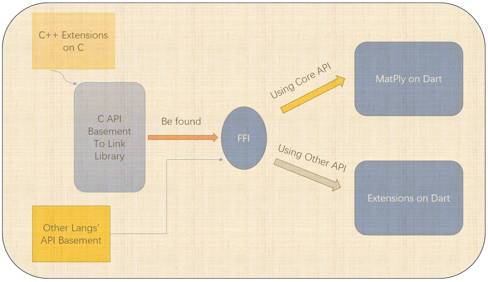

# 支持的语言与平台一览

## [Dart on Windows/Linux/Android](../API/Dart/index.md)

## [🎉] Matply V1.1.0即将推出  

2024.12.15日，我已对Matply的C底层尽可能的实现基于Openmp的优化，并修复了部分已知和遇到的bug；另外，添加了部分的实用方法（具体见文档）。经过这次底层优化和测试的经验，我决定在不久实现一个原生的Dart's Matply，顺便可以解决全平台的问题。以下是重大的底层改变。

- 移除设置单线程/多线程的方法，底层默认是多线程随机数生成函数，不需要担心线程冲突。
- C+Openmp自动优化模式。
- 原生的异步模式解决底层函数回调的未优化问题

[下一篇：如何构建Dart版本的API](../API/Dart/index.md)
