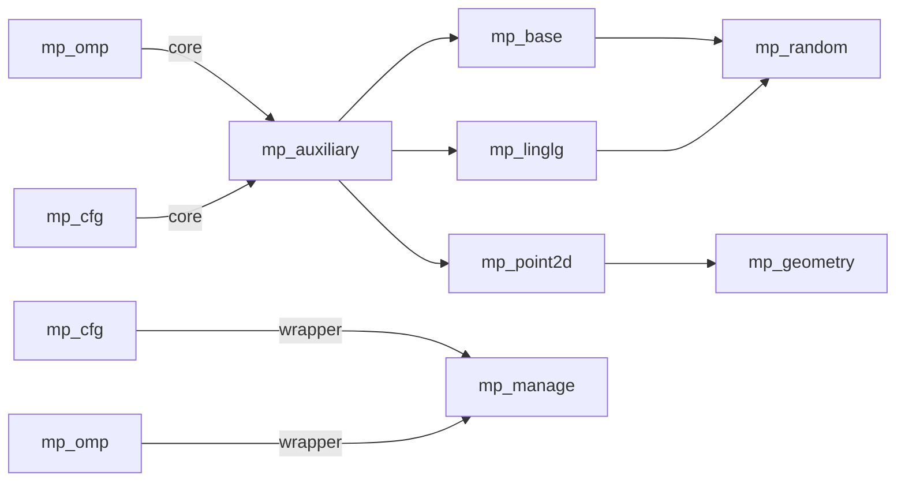

# MatPly的底层Omp设计

## 两种模式

- 安全线程模式——范围内修改启动量，设置第一次线程启动量之后会上锁，在多线程中冲突设置的时候只按照第一个启动量
- 危险线程模式——强制修改启动量大小，无视线程安全和性能
  

## 核心设计概要
- 无论是单层循环还是嵌套循环，多线程开启依赖总数据量
- 嵌套循环尽量采用坍塌优化（collaspe），单循环尽量采用simd指令
- 底层不优化的方法可能在别的语言层优化且会被记录，no_multp_msg标记的未优化方法多和函数回调有关且内部尽量不预分配内存，而是边工作边分配内存

## 已优化库(或者不用优化的)

- mp_omp
- mp_cfg
- mp_auxiliary
- mp_base
- mp_manage
- mp_point2d
- mp_linalg
- mp_random
- mp_geometry

## 设计模式蓝图

